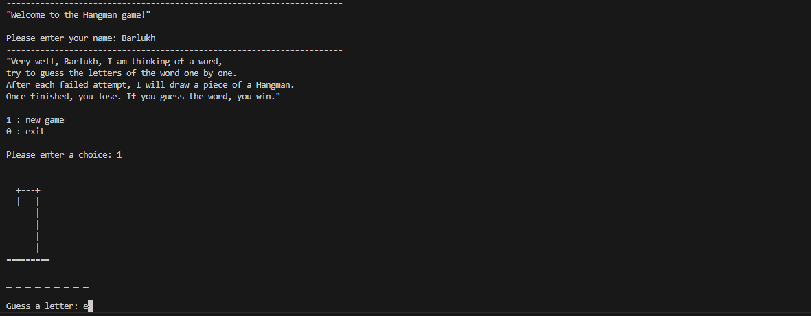

# Hangman

    

## About
A simple game of Hangman. The game is played in the terminal window. It has a simple functionality and is a copy of the classic Hangman game.

## Functionality
- The computer picks a random word from the wonderwords module and presents the player with blank spaces equal to the length of the word.
- The player tries to guess the letters of the word one by one.
- If the player guesses a letter that is not present in the word, the computer draws a piece of the Hangman figure.
- Once fully drawn, the player loses. The code repeats but gives the option to the player to exit after the game.
- The player wins if all the letters are guessed correctly, therefore revealing the whole word.
- The player input is protected to only insert valid parameters.

## Installation
- Ensure Python is installed on your system.
- Use pip to install all required packages listed in requirements.txt (pip install -r requirements.txt).
- Execute the main script to run the program (python main.py).
